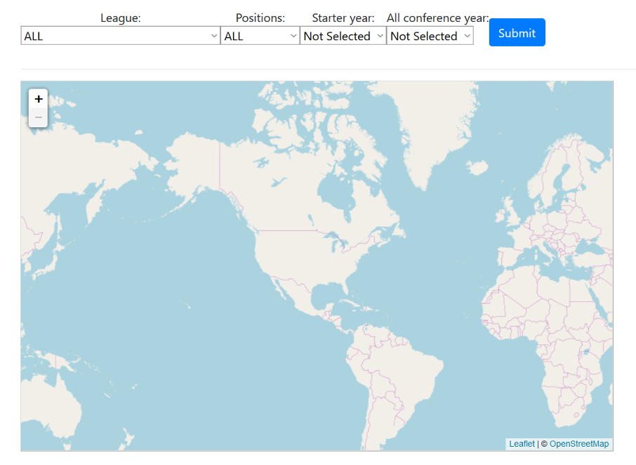
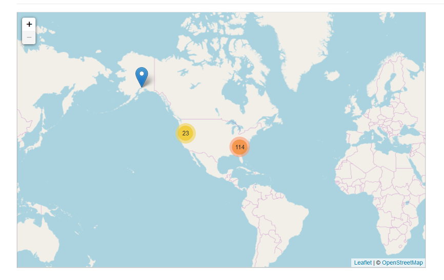
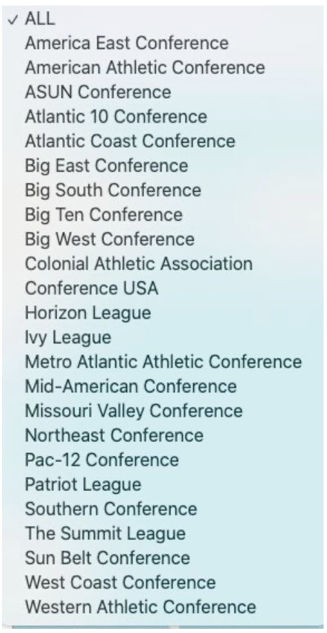
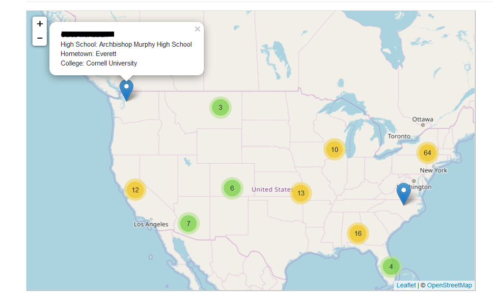
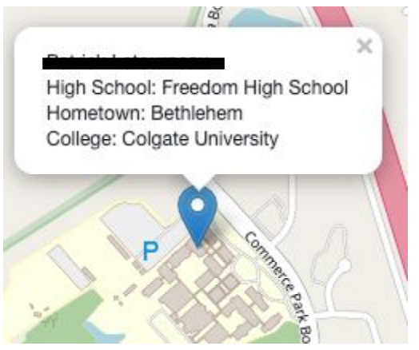
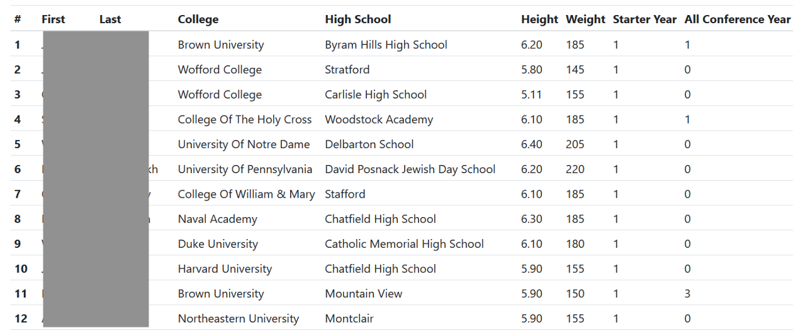

# Soccer Player Map
- An interactive soccer player data visualization web application.
- Django, PostgreSQL, JavaScript, Leaflet, HTML

(Note: For Privacy Issue, the database has been deleted from Repo and the names of players have been hidden.)

Home Page:

Select Parameters and Click Submit:

Further Zoom-In:

Table:

